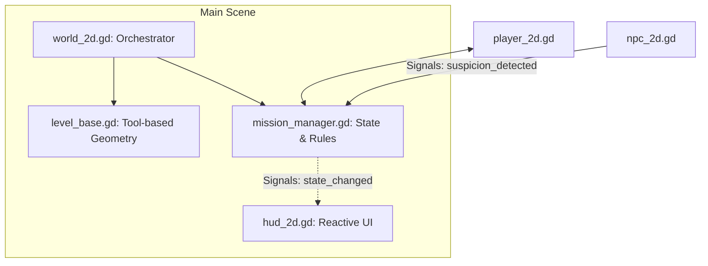

# Architecture Guide

This project is a 2D procedural stealth prototype where the world is drawn using Godot's 2D engine with an oblique projection.

## System Overview

## Project Layout

- `scenes/`
  - Scene entry points.
- `scripts/`
  - Active runtime scripts (`world_2d.gd`, `player_2d.gd`, `npc_2d.gd`).
- `art/`
  - Intentional assets used by the prototype.
- `docs/`
  - Architecture and map notes.

## Runtime Entry Points

- `scenes/main.tscn`
  - Main scene, bound to `res://scripts/world_2d.gd`.
- `scripts/world_2d.gd`
  - Active world orchestrator (boot order, generation, mission flow, HUD updates).
- `scripts/player_2d.gd`
  - Active player controller (movement, camera, stealth state, locomotion visuals).
- `scripts/npc_2d.gd`
  - Active NPC controller (patrols, detection, interactions).

## Active Modules
*   **MissionManager**: Tracks the current phase, suspicion, and objective. It is the single source of truth for the game rules.
*   **LevelBase**: Uses `@tool` scripting to build the physical world in the editor.
*   **HUD**: A reactive `CanvasLayer` that listens for signals from the `MissionManager`.

## Maintainer Conventions
- Keep `scripts/world_2d.gd` orchestration-focused.
- Prefer **Signals** over direct variable access when communicating between NPCs and the MissionManager.
- Use `GameConstants.gd` for any value that needs to be balanced (speeds, radii, colors).
